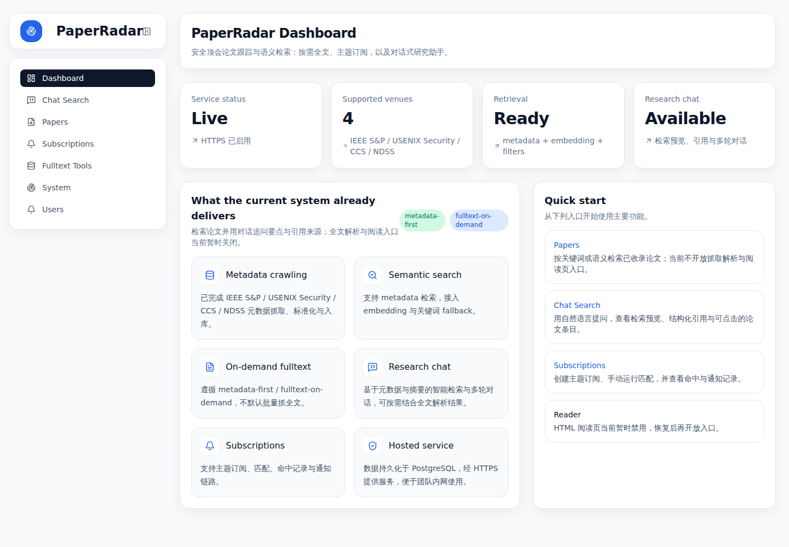
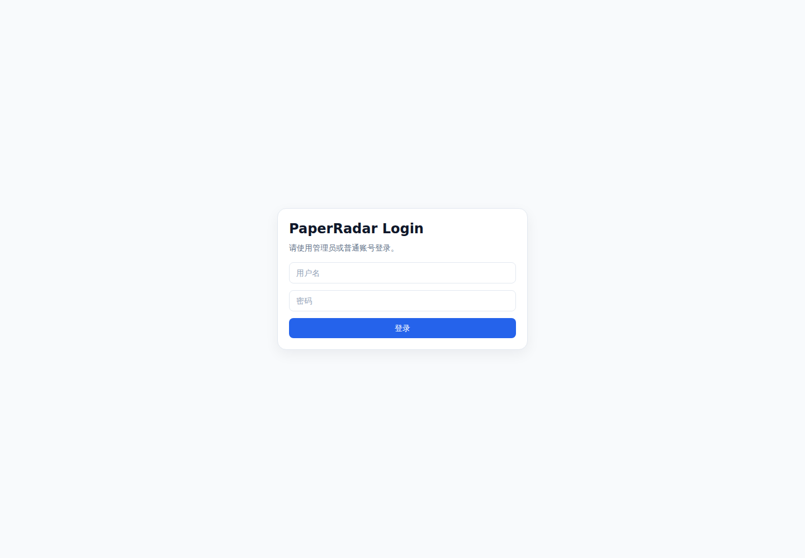
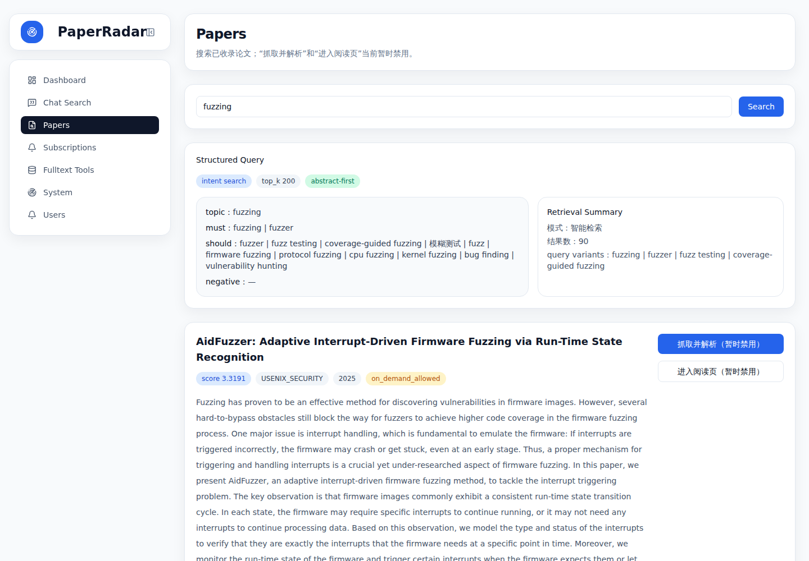
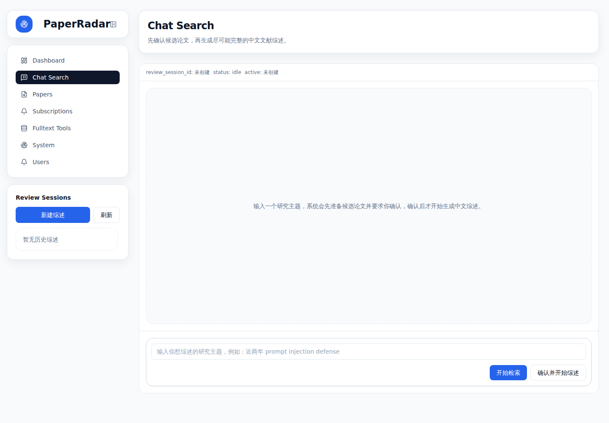
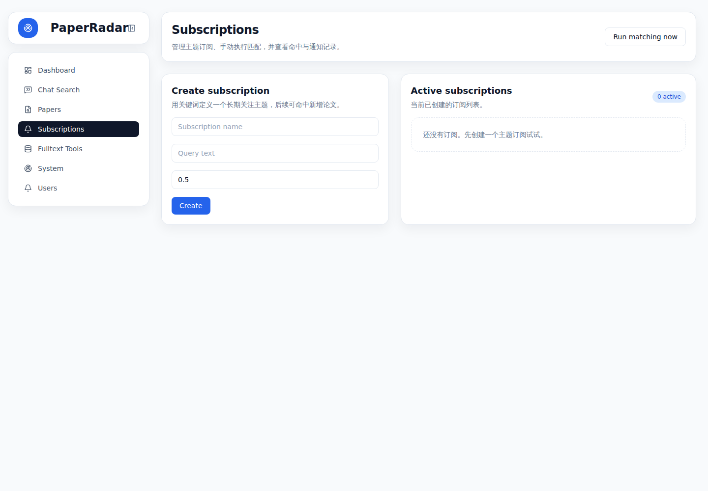
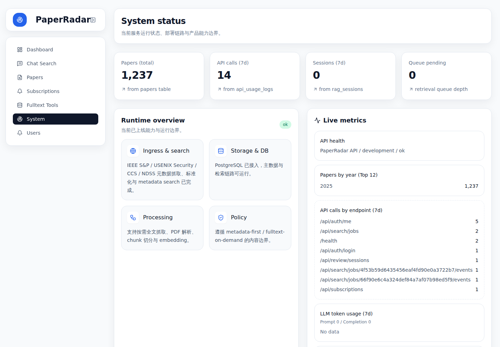

# PaperRadar

PaperRadar 是一个面向安全、系统与 AI 相关论文的论文检索、阅读、订阅和 RAG 问答系统。项目由 FastAPI 后端、Next.js 前端、PostgreSQL 数据库、Redis 检索队列 worker 以及一组数据采集/清洗脚本组成。

本仓库是一个可公开发布的干净导入版本，不包含旧 Git 历史。请不要将真实 API Key、数据库密码、服务器 IP、私钥或 `.env` 文件提交到仓库。

## 功能概览

- 论文元数据采集、归一化、入库。
- PostgreSQL 全文检索与结构化筛选。
- Google/Gemini embedding 支持，用于语义检索和主题画像。
- 论文阅读页、全文抓取、PDF 解析与状态追踪。
- Chat / RAG 问答：基于检索结果生成回答。
- Review 辅助：围绕查询生成论文综述材料。
- 用户登录、管理员用户管理与密码修改。
- 订阅、匹配和通知数据模型。
- Redis 后台队列：将较重的检索、问答、综述任务从 HTTP 请求中拆出。
- 静态导出的 Next.js 前端，可挂载在 `/paperradar` 路径下。

## 技术栈

| 层 | 技术 |
| --- | --- |
| 前端 | Next.js 15, React 19, Tailwind CSS |
| 后端 | FastAPI, Uvicorn, Pydantic |
| 数据库 | PostgreSQL, 可选 pgvector |
| 队列 | Redis |
| Embedding / LLM | Google / Gemini API |
| 部署 | systemd, nginx, 静态前端导出 |

## 目录结构

```text
.
├── app
│   ├── backend/          # FastAPI 后端、数据库模型、检索/RAG/Review 逻辑
│   ├── deploy/           # systemd、nginx、环境变量示例
│   ├── frontend/         # Next.js 前端
│   ├── scripts/          # 数据库、采集、解析、embedding、部署脚本
│   └── workers/          # 采集与元数据增强 worker
├── data/                 # 原始/解析/生成数据目录，仅保留 .gitkeep
├── docs/                 # 设计文档与历史开发记录
├── storage/              # PDF、报告、图片等运行期存储目录，仅保留 .gitkeep
├── PROJECT.md            # 运维速查
└── README.md
```

## 运行前准备

### 系统依赖

建议使用 Linux 服务器或类 Unix 环境。

需要安装：

- Python 3.11+
- Node.js 20+
- npm
- PostgreSQL 14+
- Redis 6+
- nginx（生产部署需要）
- systemd（生产部署需要）

可选：

- `pgvector`：如果希望使用向量索引加速 embedding 检索。

### 重要安全约定

1. 不要提交 `.env`、`.env.local`、`paperradar.env`、私钥、证书或真实 API Key。
2. 生产环境变量建议放在：

```bash
/etc/paperradar/paperradar.env
```

3. 仓库中的 `app/deploy/.env.example` 只能作为模板使用，必须替换其中的 `CHANGE_ME`。
4. 如果要公开部署，请将文档和配置中的 `example.com` 替换为你的域名，但不要提交真实服务器 IP（除非你确定可以公开）。

## 环境变量

复制模板并修改：

```bash
sudo mkdir -p /etc/paperradar
sudo cp app/deploy/.env.example /etc/paperradar/paperradar.env
sudo chmod 600 /etc/paperradar/paperradar.env
sudo editor /etc/paperradar/paperradar.env
```

核心变量：

```env
PAPERRADAR_APP_HOST=127.0.0.1
PAPERRADAR_APP_PORT=8100

PAPERRADAR_DB_HOST=127.0.0.1
PAPERRADAR_DB_PORT=5432
PAPERRADAR_DB_NAME=paperradar
PAPERRADAR_DB_USER=paperradar
PAPERRADAR_DB_PASSWORD=CHANGE_ME

PAPERRADAR_REDIS_URL=redis://127.0.0.1:6379/0

GOOGLE_API_KEY=
PAPERRADAR_GEMINI_MODEL=gemini-3-flash-preview
PAPERRADAR_EMBEDDING_PROVIDER=google
PAPERRADAR_EMBEDDING_MODEL=gemini-embedding-001

PAPERRADAR_ADMIN_USERNAME=admin
PAPERRADAR_ADMIN_PASSWORD=CHANGE_ME
PAPERRADAR_AUTH_COOKIE_SECURE=true
```

说明：

- `GOOGLE_API_KEY` 用于 Gemini / embedding 功能；不配置时，依赖 LLM 或 embedding 的功能会不可用。
- `PAPERRADAR_ADMIN_PASSWORD` 必须在首次启动前设置为强密码。
- 本地开发时可使用项目根目录 `.env.local`；该文件已被 `.gitignore` 忽略。


## 随仓库包含的论文数据

本公开仓库随 Git 一起包含一份已抓取并处理过的论文数据种子文件：

```text
data/seed/paperradar-paperdata.sql.gz
```

该文件是 PostgreSQL SQL dump 的 gzip 压缩版本，压缩后约 58MB，低于 GitHub 单文件 100MB 限制。校验文件：

```text
data/seed/paperradar-paperdata.sql.gz.sha256
```

当前 seed 数据聚焦 **2025 年四大安全顶会**，共包含 1237 篇论文元数据及其衍生处理结果：

| 会议 | 年份 | 论文数 |
| --- | ---: | ---: |
| USENIX Security Symposium | 2025 | 455 |
| ACM Conference on Computer and Communications Security (CCS) | 2025 | 316 |
| IEEE Symposium on Security and Privacy (S&P) | 2025 | 255 |
| NDSS Symposium | 2025 | 211 |
| **合计** |  | **1237** |

按数据表统计：

| 数据表 | 数量 |
| --- | ---: |
| venues | 4 |
| venue_editions | 4 |
| papers | 1237 |
| paper_metadata_embeddings | 1237 |
| paper_topic_profiles | 1231 |
| paper_topic_profile_runs | 1542 |
| query_translation_rules | 25 |
| query_type_cache | 90 |
| query_translation_cache | 37 |
| query_embedding_cache | 30 |

包含内容：

- 2025 年 USENIX Security、ACM CCS、IEEE S&P、NDSS 四大安全顶会论文元数据。
- 论文标题、作者、摘要、DOI、来源 URL、内容策略等字段。
- 已生成的 metadata embedding，可用于语义检索。
- 已生成的 topic profile 与相关运行记录，可用于主题浏览和 RAG 检索增强。
- 查询归一化、查询类型、查询 embedding 等缓存和规则表。

内容策略说明：

- USENIX Security、ACM CCS、NDSS 论文记录标记为 `on_demand_allowed`，支持按需抓取全文。
- IEEE S&P 论文记录标记为 `metadata_only`，默认只提供元数据。
- seed 不包含本地下载的 PDF 全文文件。

不包含内容：

- 真实 API Key、私钥、证书或 `.env` 文件。
- 用户密码明文。
- 登录 session。
- 本地下载的 PDF 文件或生成报告。

### 从 seed 恢复数据

如果你使用 Docker 单容器部署，通常不需要手动恢复：容器首次启动时会在 `papers` 表为空的情况下自动导入该 seed。

如果你关闭了自动导入，或需要手动重新导入，可以执行：

```bash
gunzip -c data/seed/paperradar-paperdata.sql.gz | docker exec -i paperradar psql \
  -h 127.0.0.1 \
  -U paperradar \
  paperradar
```

如果你在本机直接部署 PostgreSQL：

```bash
gunzip -c data/seed/paperradar-paperdata.sql.gz | \
  PGPASSWORD='你的数据库密码' psql \
  -h 127.0.0.1 \
  -U paperradar \
  -d paperradar
```

恢复前建议先初始化 schema：

```bash
cd app
PYTHONPATH=. python3 scripts/apply_schema.py
```

## Docker 单容器一键部署（推荐给个人部署）

为了降低部署门槛，本仓库提供了应用单容器部署方案。容器对外只暴露一个 HTTP 端口，用户可按需在宿主机、云平台或网关侧自行配置 nginx / Caddy / Traefik / HTTPS。

容器内运行：

- FastAPI：监听 `8080`，同时提供 API 和前端静态文件。
- retrieval worker：消费 Redis 队列中的重型检索/问答/综述任务。
- Redis：容器内本地队列。
- PostgreSQL：容器内本地数据库，数据持久化到 Docker volume。

容器内不封装 nginx。这样更符合常规 Docker 部署方式：应用容器只提供服务端口，反向代理和证书由部署环境负责。

这种方式适合个人服务器、演示环境、小规模自用部署。若你需要高可用、独立备份、数据库升级和多实例扩展，建议使用后文的传统 systemd/PostgreSQL/Redis 拆分部署，或改造成 Docker Compose。

### 1. 构建镜像

```bash
# 默认使用阿里云 Debian / PyPI 镜像和 npmmirror npm 镜像
docker build -t paperradar:latest .

# 如需切换镜像源，可覆盖 build args
docker build -t paperradar:latest \
  --build-arg APT_MIRROR=https://mirrors.tuna.tsinghua.edu.cn \
  --build-arg NPM_REGISTRY=https://registry.npmmirror.com \
  --build-arg PIP_INDEX_URL=https://pypi.tuna.tsinghua.edu.cn/simple \
  --build-arg PIP_TRUSTED_HOST=pypi.tuna.tsinghua.edu.cn \
  .
```

### 2. 一键启动

Docker 单容器模式会在首次启动时自动初始化 PostgreSQL schema，并在 `papers` 表为空时自动导入随仓库包含的 2025 年四大安全顶会论文 seed 数据（1237 篇）。

最小启动示例：

```bash
docker volume create paperradar-pgdata
docker volume create paperradar-data

docker run -d \
  --name paperradar \
  --restart unless-stopped \
  -p 8080:8080 \
  -v paperradar-pgdata:/var/lib/postgresql/data \
  -v paperradar-data:/var/lib/paperradar \
  -e PAPERRADAR_DB_PASSWORD='CHANGE_ME_DB_PASSWORD' \
  -e PAPERRADAR_ADMIN_USERNAME='admin' \
  -e PAPERRADAR_ADMIN_PASSWORD='CHANGE_ME_ADMIN_PASSWORD' \
  -e GOOGLE_API_KEY='YOUR_GOOGLE_API_KEY' \
  paperradar:latest
```

访问：

```text
http://<server-ip>:8080/paperradar/
```

关键页面截图：

| Dashboard | 登录 |
| --- | --- |
|  |  |

| 论文检索 | 对话式检索 |
| --- | --- |
|  |  |

| 主题订阅 | 系统状态 |
| --- | --- |
|  |  |

API 健康检查：

```bash
curl http://127.0.0.1:8080/health
```

如果暂时不使用 LLM / embedding 功能，可以省略 `GOOGLE_API_KEY`，但 Chat、Review、embedding 相关能力会受限。

### 3. 反向代理示例

容器只提供 HTTP 服务。如果要绑定域名和 HTTPS，建议在宿主机或云平台上反向代理到容器端口。

宿主机 nginx 示例：

```nginx
server {
    listen 443 ssl http2;
    server_name example.com;

    # ssl_certificate ...;
    # ssl_certificate_key ...;

    location / {
        proxy_pass http://127.0.0.1:8080;
        proxy_http_version 1.1;
        proxy_set_header Host $host;
        proxy_set_header X-Real-IP $remote_addr;
        proxy_set_header X-Forwarded-For $proxy_add_x_forwarded_for;
        proxy_set_header X-Forwarded-Proto https;
    }
}
```

然后访问：

```text
https://example.com/paperradar/
```

### 4. 常用 Docker 命令

查看日志：

```bash
docker logs -f paperradar
```

进入容器：

```bash
docker exec -it paperradar bash
```

重启：

```bash
docker restart paperradar
```

停止并删除容器，但保留数据卷：

```bash
docker rm -f paperradar
```

### 5. 数据导入和维护

容器启动时会自动初始化 PostgreSQL 并执行数据库 schema。默认情况下，如果数据库中还没有论文记录，容器会自动导入：

```text
data/seed/paperradar-paperdata.sql.gz
```

也可以通过环境变量控制 seed 导入：

```bash
-e PAPERRADAR_AUTO_IMPORT_SEED=true   # 默认：自动导入
-e PAPERRADAR_AUTO_IMPORT_SEED=false  # 跳过自动导入
-e PAPERRADAR_SEED_PATH=/opt/paperradar/data/seed/paperradar-paperdata.sql.gz
```

如果要运行项目脚本，例如采集、归一化、入库：

```bash
docker exec -it paperradar bash
cd /opt/paperradar/app
PYTHONPATH=. python3 scripts/crawl_metadata.py
PYTHONPATH=. python3 scripts/normalize_metadata.py
PYTHONPATH=. python3 scripts/ingest_papers_to_postgres.py
```

构建 embedding：

```bash
docker exec -it paperradar bash
cd /opt/paperradar/app
PYTHONPATH=. python3 scripts/build_metadata_embeddings.py
```

### 6. 备份和恢复

备份数据库：

```bash
docker exec paperradar pg_dump \
  -h 127.0.0.1 \
  -U paperradar \
  paperradar > paperradar.sql
```

恢复数据库示例：

```bash
cat paperradar.sql | docker exec -i paperradar psql \
  -h 127.0.0.1 \
  -U paperradar \
  paperradar
```

如果执行备份时需要密码，可临时加：

```bash
PGPASSWORD='CHANGE_ME_DB_PASSWORD'
```

### 7. 单容器方案的限制

- PostgreSQL、Redis、API 和 worker 在同一个容器内，故障隔离较弱。
- 数据库升级和备份需要自行管理 Docker volume。
- 不适合多副本横向扩展。
- 默认不启用 HTTPS；HTTPS 建议由宿主机反向代理或云服务提供。
- 默认前端挂载路径是 `/paperradar`，如需改路径，需要同步调整 `app/frontend/next.config.js` 和后端静态路由。

## 本地开发

以下命令假设当前目录为项目根目录。

### 1. 安装后端依赖

```bash
cd app/backend
python3 -m venv .venv
source .venv/bin/activate
pip install -r requirements.txt
```

如果不使用虚拟环境，也可以直接安装到系统 Python，但生产环境不推荐这样做。

### 2. 安装前端依赖

```bash
cd app/frontend
npm install
```

### 3. 启动 PostgreSQL 和 Redis

示例：

```bash
sudo systemctl enable --now postgresql
sudo systemctl enable --now redis
```

创建数据库和用户示例：

```bash
sudo -u postgres psql
```

在 psql 中执行：

```sql
CREATE USER paperradar WITH PASSWORD 'CHANGE_ME';
CREATE DATABASE paperradar OWNER paperradar;
\q
```

请将密码替换为你自己的强密码，并同步写入环境变量。

### 4. 初始化数据库 Schema

```bash
cd app
PYTHONPATH=. python3 scripts/apply_schema.py
```

如需测试数据库连接：

```bash
PYTHONPATH=. python3 scripts/check_db.py
```

### 5. 启动后端

```bash
cd app
PYTHONPATH=. bash scripts/run_backend.sh
```

后端默认监听：

```text
http://127.0.0.1:8100
```

健康检查：

```bash
curl http://127.0.0.1:8100/health
```

### 6. 启动前端

另开终端：

```bash
cd app
bash scripts/run_frontend.sh
```

开发前端默认地址：

```text
http://127.0.0.1:3100
```

### 7. 启动检索队列 worker

部分重型任务依赖 Redis worker：

```bash
cd app
PYTHONPATH=. python3 -m backend.retrieval_worker
```

## 数据导入与处理

常用脚本位于 `app/scripts/`。

### 抓取和归一化元数据

```bash
cd app
PYTHONPATH=. python3 scripts/crawl_metadata.py
PYTHONPATH=. python3 scripts/normalize_metadata.py
```

### 导入 PostgreSQL

```bash
cd app
PYTHONPATH=. python3 scripts/ingest_papers_to_postgres.py
```

### 构建 metadata embedding

需要配置 `GOOGLE_API_KEY`：

```bash
cd app
PYTHONPATH=. python3 scripts/build_metadata_embeddings.py
```

### 构建主题画像

```bash
cd app
PYTHONPATH=. python3 scripts/build_topic_profiles.py
```

### 全文抓取与解析

```bash
cd app
PYTHONPATH=. python3 scripts/fetch_fulltext.py
PYTHONPATH=. python3 scripts/parse_fulltext.py
PYTHONPATH=. python3 scripts/fulltext_status.py
```

> 注意：请遵守论文来源网站的访问政策、版权要求和 robots 规则。不要将下载得到的 PDF 或生成报告提交到 Git。

## 传统生产部署（拆分服务）

如果不想把 PostgreSQL、Redis、API 和 worker 放进同一个容器，可以使用下面的拆分式部署。以下示例使用：

- 项目目录：`/opt/paperradar`
- 前端公开路径：`https://example.com/paperradar`
- API 公开路径：`https://example.com/paperradar-api/`
- 后端监听：`127.0.0.1:8100`
- 前端静态目录：`/var/www/paperradar`
- 环境变量文件：`/etc/paperradar/paperradar.env`

请按你的实际服务器修改域名和路径。

### 1. 放置代码

```bash
sudo mkdir -p /opt
sudo chown "$USER":"$USER" /opt
cd /opt
git clone <your-public-repo-url> paperradar
cd paperradar
```

如果你已经在本机创建了干净仓库，也可以直接复制到 `/opt/paperradar`。

### 2. 安装依赖

```bash
cd /opt/paperradar/app/backend
python3 -m pip install -r requirements.txt

cd /opt/paperradar/app/frontend
npm ci
```

### 3. 准备数据库和 Redis

```bash
sudo systemctl enable --now postgresql
sudo systemctl enable --now redis
```

创建数据库和用户后，初始化 Schema：

```bash
cd /opt/paperradar/app
PYTHONPATH=. python3 scripts/apply_schema.py
```

### 4. 准备生产环境变量

```bash
sudo mkdir -p /etc/paperradar
sudo cp /opt/paperradar/app/deploy/.env.example /etc/paperradar/paperradar.env
sudo chmod 600 /etc/paperradar/paperradar.env
sudo editor /etc/paperradar/paperradar.env
```

必须修改：

- `PAPERRADAR_DB_PASSWORD`
- `PAPERRADAR_ADMIN_PASSWORD`
- `GOOGLE_API_KEY`（如需 LLM / embedding）
- 其他与你的数据库、Redis、模型相关的配置

### 5. 构建并发布前端静态文件

```bash
cd /opt/paperradar/app/frontend
npm run build
sudo mkdir -p /var/www/paperradar
sudo rsync -a --delete out/ /var/www/paperradar/
```

前端生产构建会使用 `basePath=/paperradar`，因此适合挂在 `/paperradar` 路径下。

### 6. 安装 systemd 服务

```bash
sudo cp /opt/paperradar/app/deploy/paperradar-api.service /etc/systemd/system/
sudo cp /opt/paperradar/app/deploy/paperradar-retrieval-worker.service /etc/systemd/system/
sudo systemctl daemon-reload
sudo systemctl enable --now paperradar-api
sudo systemctl enable --now paperradar-retrieval-worker
```

检查状态：

```bash
systemctl status paperradar-api --no-pager
systemctl status paperradar-retrieval-worker --no-pager
curl http://127.0.0.1:8100/health
```

> `paperradar-web.service` 是 Next.js server 模式示例；当前推荐方式是 `output: 'export'` 后由 nginx 托管静态文件，因此通常不需要启用该服务。

### 7. 配置 nginx

将 `app/deploy/nginx-paperradar.conf` 中的 location 配置包含进你的 HTTPS server block。

示例：

```bash
sudo cp /opt/paperradar/app/deploy/nginx-paperradar.conf /etc/nginx/snippets/paperradar-location.conf
```

在你的 nginx 站点配置中加入：

```nginx
server {
    listen 443 ssl http2;
    server_name example.com;

    # ssl_certificate ...;
    # ssl_certificate_key ...;

    include /etc/nginx/snippets/paperradar-location.conf;
}
```

检查并重载：

```bash
sudo nginx -t
sudo systemctl reload nginx
```

### 8. 验证生产部署

```bash
curl -I https://example.com/paperradar
curl https://example.com/paperradar-api/health
```

如果使用自签名证书，可临时加 `-k` 测试。

## 发布更新

仓库内提供了部署脚本：

```bash
cd /opt/paperradar
bash app/scripts/deploy.sh frontend   # 只构建并发布前端
bash app/scripts/deploy.sh backend    # 只重启后端和 worker
bash app/scripts/deploy.sh all        # 前端 + 后端 + nginx reload
```

脚本假设：

- 静态前端目录为 `/var/www/paperradar/`
- systemd 服务名为 `paperradar-api` 和 `paperradar-retrieval-worker`
- 后端健康检查为 `http://127.0.0.1:8100/health`

如你的服务器布局不同，请先修改 `app/scripts/deploy.sh`。

## 常用接口

| 方法 | 路径 | 说明 |
| --- | --- | --- |
| GET | `/health` | 健康检查 |
| POST | `/api/auth/login` | 登录 |
| GET | `/api/auth/me` | 当前用户 |
| POST | `/api/search` | 同步论文检索 |
| POST | `/api/search/jobs` | 异步检索任务 |
| POST | `/api/chat/message` | 同步 Chat/RAG 消息 |
| POST | `/api/chat/message/jobs` | 异步 Chat/RAG 消息 |
| POST | `/api/review/prepare` | 准备综述材料 |
| POST | `/api/review/generate` | 生成综述内容 |
| GET | `/api/reader/{paper_id}` | 论文阅读页数据 |
| GET/POST | `/api/subscriptions` | 订阅管理 |

## 运维与排错

### 查看服务日志

```bash
journalctl -u paperradar-api -f
journalctl -u paperradar-retrieval-worker -f
```

### 检查端口

```bash
ss -tlnp | grep -E '8100|6379|5432'
```

### 检查数据库

```bash
cd /opt/paperradar/app
PYTHONPATH=. python3 scripts/check_db.py
```

### 检查 Google API Key

```bash
cd /opt/paperradar/app
PYTHONPATH=. python3 scripts/check_google_key.py
```

### 常见问题

1. **前端静态资源 404**  
   确认生产构建后执行过 `rsync -a --delete out/ /var/www/paperradar/`，并检查 nginx 中 `/paperradar/_next/` 的 `alias` 路径。

2. **API 502**  
   检查 `paperradar-api` 是否运行，确认 `curl http://127.0.0.1:8100/health` 正常。

3. **检索或问答任务卡住**  
   检查 Redis 和 `paperradar-retrieval-worker` 是否运行。

4. **LLM / embedding 报错**  
   检查 `GOOGLE_API_KEY` 是否存在、有效，以及服务器网络是否能访问对应 API。

5. **数据库认证失败**  
   确认 PostgreSQL 用户、数据库、密码与 `/etc/paperradar/paperradar.env` 一致。

## 公开仓库注意事项

公开前建议运行以下检查：

```bash
rg -n --hidden -g '!.git' -g '!app/frontend/out/**' \
  'BEGIN .*PRIVATE KEY|API_KEY=.+|PASSWORD=.+|AKIA[0-9A-Z]{16}|gh[pousr]_|sk-[A-Za-z0-9_-]{20,}|[0-9]+\.[0-9]+\.[0-9]+\.[0-9]+'
```

确认：

- 没有真实密钥、token、私钥、证书。
- 没有真实生产数据库密码。
- 没有不希望公开的服务器 IP、用户名、本地路径。
- `data/` 和 `storage/` 下只提交 `.gitkeep`，不提交 PDF、报告或运行产物。

## License

请在公开前根据你的需求添加许可证文件，例如 MIT、Apache-2.0 或其他合适许可证。
